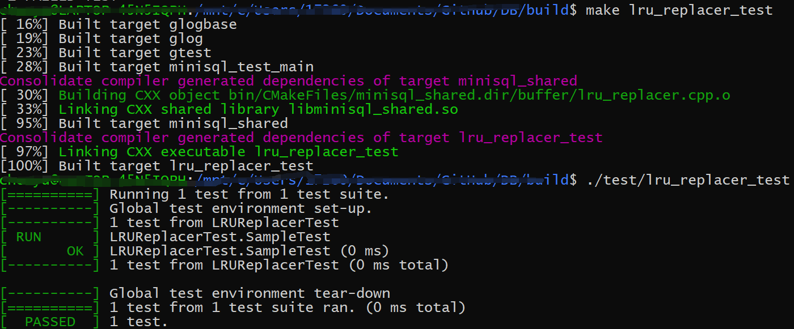

# MiniSQL阶段报告1

——Disk and Buffer Pool Manager

## 1.1 实验概述

本阶段我们需要实现Disk Manager和Buffer Pool Manager模块

- Disk Manager主要负责数据库文件中数据页的分配和回收（Bitmap实现），以及数据页中数据的读取和写入。
- Buffer Pool Manager将磁盘中的数据页从内存中移动到磁盘。

## 1.2 实现一个简单的位图页

位图页（Bitmap page）

- 占用`PAGE_SIZE`（4KB）的空间，标记一段连续页的分配情况。
- 组成：
  - 元信息（Bitmap Page Meta）
    - 已经分配的页的数量（`page_allocated_`）
    - 下一个空闲的数据页(`next_free_page_`)
  - Bitmap存储的具体数据

**实现**

- `BitmapPage::AllocatePage(&page_offset)` 分配一个空闲页
  - 判断是否已经达到最大的supported size，如果已经达到，不能成功分配，返回`false`
  - `page_offset = next_free_page_`，通过`byte_index value of page_offset / 8`以及`bit_index value of page_offset % 8`，找到该页所在的位置，并且将该位置置1，更新已分配的页数`page_allocated_`以及`next_free_page_`

- `BitmapPage::DeAllocatePage(page_offset)` 回收已经被分配的页
  - 通过`page_offset`计算bit位
  - 将该bit位置0

- `BitmapPage::IsPageFree(page_offset)` 判断给定的页是否是空闲的
  - 通过`page_offset`计算bit位
  - 如果该bit位为0，则空闲，返回`true`，否则返回`false`

## 1.3 磁盘数据页管理
实现:

使用`DiskManager`来管理磁盘的页分配和释放。使用数据`Disk Meta Page`来管理维护各个分区`extent`.各个分区由各自的`bitmap`维护分区内的页分配和释放。下面实现`DiskManager`这几个函数：
- `DiskManager::AllocatePage()`
  - 获取`logical_page_id`所在的分区的`bitmap`,调用此`bitmap`的`AllocatePage`函数，完成页的分配。

- `DiskManager::DeAllocatePage(logical_page_id)`
  - 获取`logical_page_id`所在的分区的`bitmap`,调用此`bitmap`的`DeAllocatePage`函数，完成页的释放。

- `DiskManager::IsPageFree(logical_page_id)`
  - 获取`logical_page_id`所在的分区的`bitmap`,调用此`bitmap`的`IsPageFree`函数，判断此页是否空闲。

- `DiskManager::MapPageId(logical_page_id)`
  - 根据一个分区的大小构造逻辑页号和物理页号的映射。
  

测试：

## 1.4 LRU替换策略

实现：

将在buffer pool中没有pin的页帧数存放在一个链表`lru_list_`中，最新访问的页移到链表末尾，这样，链表第一个元素即最近最少访问的元素，根据LRU策略，即可以将它替换。

- `LRUReplacer::Victim(*frame_id)`
  - 找到最近最少访问的元素，即链表的起始元素，这是被victim的页面
  - 如果链表为空，返回`false`，此时在buffer pool中的页面都不可被替换
- `LRUReplacer::Pin(frame_id)`
  - 将该数据页从`lru_list_`中移除
- `LRUReplacer::Unpin(frame_id)`
  - 将该数据页放入`lru_list_`中
- `LRUReplacer::Size()`即`lru_list_`链表元素的个数

测试：

## 1.5 缓冲池管理

