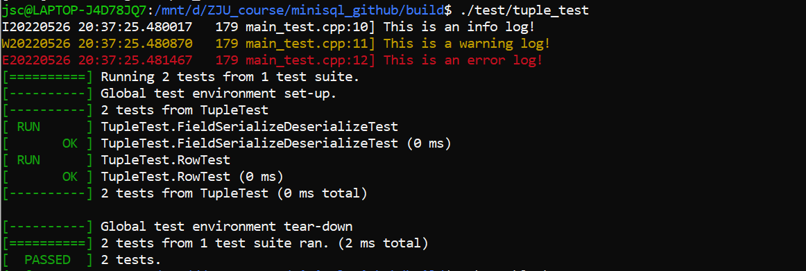
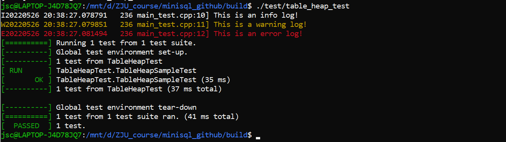

# MiniSQL阶段报告2

——Record Manager

> 第七小组

## 2.1 实验概述

在MiniSQL的设计中，Record Manager负责管理数据表中所有的记录，它能够支持记录的插入、删除与查找操作，并对外提供相应的接口。

## 2.2 记录与模式

为了能够持久化存储上面提到的`Row`、`Field`、`Schema`和`Column`对象，我们需要提供一种能够将这些对象序列化成字节流（`char*`）的方法，以写入数据页中。与之相对，为了能够从磁盘中恢复这些对象，我们同样需要能够提供一种反序列化的方法，从数据页的`char*`类型的字节流中反序列化出我们需要的对象。

**实现**

- `Row::SerializeTo(*buf, *schema)`
  - 依次将`Row`中`field`的个数，`bitmap`，以及各个`field`的内容序列化，写入`buf`指向的内容中，其中调用已经完成的`field`的`SerializeTo`函数。
- `Row::DeserializeFrom(*buf, *schema)`
  - 将`buf`指向的内容依次解释为`field`的个数，`bitmap`以及`field`的序列化数据。其中调用已经完成的`field`的 `DeserializeFrom`函数。
- `Row::GetSerializedSize(*schema)`
  - 返回此`row`序列化后的字节偏移量。
- `Column::SerializeTo(*buf)`
  - 依次将`Column`中的`COLUMN_MAGIC_NUM`,`name_.length()`,`name_`,`type_`,`len_`,`table_ind_`,`nullable_`,`unique_`写入`buf`指向的内容。
- `Column::DeserializeFrom(*buf, *&column, *heap)`
  - 将`buf`指向的内容依次解释为`COLUMN_MAGIC_NUM`,`name_.length()`,`name_`,`type_`,`len_`,`table_ind_`,`nullable_`,`unique_`。其中需要验证`COLUMN_MAGIC_NUM`。
- `Column::GetSerializedSize()`
  - 返回`Column`序列化的字节偏移量
- `Schema::SerializeTo(*buf)`
  - 依次将`SCHEMA_MAGIC_NUM`,`columns_.size()`,以及各个`Column`内容序列化，写入`buf`指向的内容，其中调用`Column::SerializeTo(*buf)`。
- `Schema::DeserializeFrom(*buf, *&schema, *heap)`
  - 依次将`buf`指向的内容解释为`SCHEMA_MAGIC_NUM`,`columns_.size()`以及各个`column`的序列化数据，其中调用`Column::DeserializeFrom(*buf, *&column, *heap)`且须验证`SCHEMA_MAGIC_NUM`。
- `Schema::GetSerializedSize()`
  - 返回`Schema`序列化的字节偏移量

测试：

## 2.3 通过堆表管理记录
实现:

- `TableHeap:InsertTuple(&row, *txn)`
  - 插入一条新记录。检查此记录是否超过`TablePage::MaxTupleSize()`，若超过上限，打印错误信息。否则找寻第1个能够容纳此记录的页并插入。若所有已分配页均无法容纳，新申请一页并插入，将新页插入页链表。
- `TableHeap:UpdateTuple(&new_row, &rid, *txn)`
  - 更新`rid`处的记录。找到`rid`所在页，并调用`update()`。若更新失败，返回错误信息返回。若错误信息指出是新记录无法容纳，则在原页中删除此记录，再调用`TableHeap:InsertTuple(&row, *txn)`。
- `TableHeap:ApplyDelete(&rid, *txn)`
  - 找到此`rid`的位置，调用删除函数。
- `TableHeap:GetTuple(*row, *txn)`
  - 获取RowId为row->rid_的记录。
- `TableHeap:FreeHeap()`
  - 依次遍历页链表，删除所有页
- `TableHeap::Begin()`
  - 获取第一页的第一条记录，返回堆表的首迭代器。迭代器中记录`rid`信息，此记录所在页指针，和`tableheap*`。
- `TableHeap::End()`
  - 获取堆表的尾迭代器。`rid`中的成员均为无效成员，页指针为`nullptr`
- `TableIterator::operator++()`
  - 移动到下一条记录，通过++iter调用。检查此记录是否为此页最后一条记录，若不是则移动到下一条记录。若是，则找寻下一页直到遇到无效页或一个含有有效记录的的页。
- `TableIterator::operator++(int)`
  - 移动到下一条记录，通过iter++调用。调用`TableIterator::operator++()`实现

测试：

