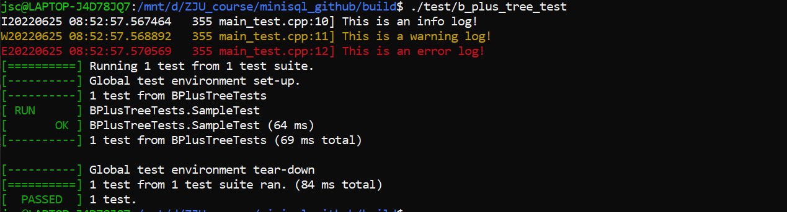
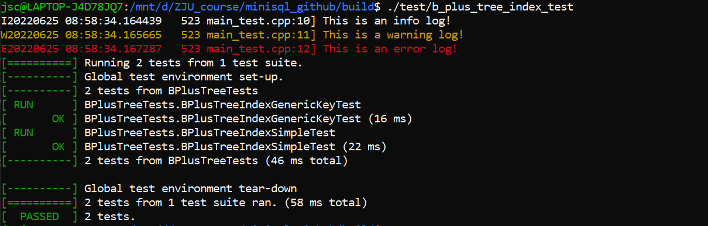
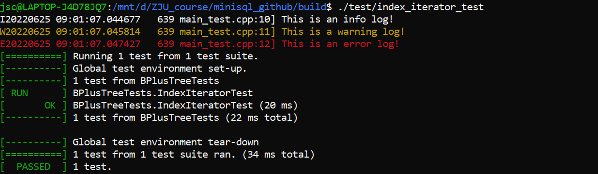

# MiniSQL阶段报告3

——INDEX MANAGER

> 第七小组

## 3.1 实验概述

`Index Manager` 负责数据表索引的实现和管理，包括：索引的创建和删除，索引键的等值查找，索引键的范围查找（返回对应的迭代器），以及插入和删除键值等操作，并对外提供相应的接口。

## 3.2 B+树数据页

### 3.2.1 BPlusTreePage
实现: `BPlusTreePage`是`BPlusTreeInternalPage`和`BPlusTreeLeafPage`类的公共父类，它包含了中间结点和叶子结点共同需要的数据：
- `page_type_`: 标记数据页是中间结点还是叶子结点；
- `size_`: 当前结点中存储Key-Value键值对的数量；
- `max_size_`: 当前结点最多能够容纳Key-Value键值对的数量；
- `parent_page_id_`: 父结点对应数据页的page_id;
- `page_id_`: 当前结点对应数据页的page_id。

在`BPlusTreePage`的实现中，主要完成一些辅助函数用于实现`BPlusTreeInternalPage`和`BPlusTreeLeafPage`类。
### 3.2.2 BPlusTreeInternalPage
实现:
中间结点`BPlusTreeInternalPage`不存储实际的数据，它只按照顺序存储$m$个键和$m+1$个指针。以下对一些重要的函数做出解释：
- `Lookup(key, comparato)`:查找对应某个key的值，在具体实现时为指针，即`page_id`。使用二分查找实现。
- `MoveHalfTo(*recipient, *buffer_pool_manager)`:将其中一半的`pair`转移到`recipient`中，用于分裂。
- `MoveFirstToEndOf(*recipient, &middle_key, *buffer_pool_manager)`:将此页第1个元素移动到`recipient`末尾。用于删除时的重新分配。
- `MoveLastToFrontOf(*recipient, &middle_key, *buffer_pool_manager)`:将此页最后1个的元素移动到`recipient`末尾。用于删除时的重新分配。
- `MoveAllTo(*recipient, const &middle_key, *buffer_pool_manager)`: 将此页中的所有元素移动到`recipient`中。用于删除时的合并操作。

### 3.2.3 BPlusTreeLeafPage
实现：
叶结点`BPlusTreeLeafPage`存储实际的数据，它按照顺序存储$m$个键和$m$个值，其中键由一个或多个Field序列化得到。
叶节点中的函数和中间节点的函数类似，只是储存的值的个数与类型有所不同。由于叶节点没有孩子，插入和删除时不需要更改孩子的`parent`指针，因此函数不需要`buffer_pool_manager`。

### 3.2.4 KeyType、ValueType & KeyComparator

对于B+树中涉及到的索引键的比较，由于模板参数`KeyType`实际传入的对象并不是基本数据类型，因此不能够直接使用比较运算符>、<等进行比较。为此，我们需要借助传入的比较器KeyComparator对两个索引键进行比较。具体实现已经在框架中给出。

## 3.3 B+树索引
在完成B+树结点的数据结构设计后，接下来需要完成B+树的创建、插入、删除、查找和释放等操作。我们需要完成`BPlusTree`类中的插入和删除操作。

`BPlusTree`类维护一个根节点的页号，使用此根节点中存放的孩子页号访问b+树的数据。

下面对几个重要的函数进行解释：

- `Insert`:向索引中插入数据。若树非空则调用`InsertIntoLeaf`函数否则新建根节点并插入数据。
- `InsertIntoLeaf`：向叶子节点插入数据。若需分裂，分裂为两个孩子，调用`InsertIntoParent`。
- `InsertIntoParent`：若插入后导致父结点分裂，递归调用直到不发生分裂。
- `Remove`：删除叶节点数据并更新中间节点。若有叶节点不满足b+树要求，调用`CoalesceOrRedistribute`处理合并或重新分配。
- `CoalesceOrRedistribute`：合并或重新分配此节点内的数据。并且更新父结点。若更新后父结点不满足要求，递归调用`CoalesceOrRedistribute`直到所有节点满足b+树要求。

## 3.4 B+树索引迭代器

我们需要为B+树索引也实现一个迭代器。该迭代器能够将所有的叶结点组织成为一个单向链表，然后沿着特定方向有序遍历叶结点数据页中的每个键值对

由于叶节点本身有指针指向相邻的下一个叶节点，只需要找到索引中最小的元素位置，遍历节点中的所有数据，再使用指针获取下一个叶节点，直到遍历所有叶节点即可。

自定义迭代器类内维护的数据：
- `target_leaf_`：指向叶节点页的指针。
- `index_`：当前数据在此页中的下标。
- `buffer_pool_manager_`：用于释放数据页和获取数据页。

遍历由重载自增操作完成：

- `operator++()`:递增迭代器，若此迭代器指向元素为此节点最后一个元素，则获取下一页第一个元素，更新迭代器信息。

## 3.5 测试结果

### 3.5.1 b_plus_tree_test

### 3.5.2 b_plus_tree_index_test

### 3.5.23 index_iterator_test

