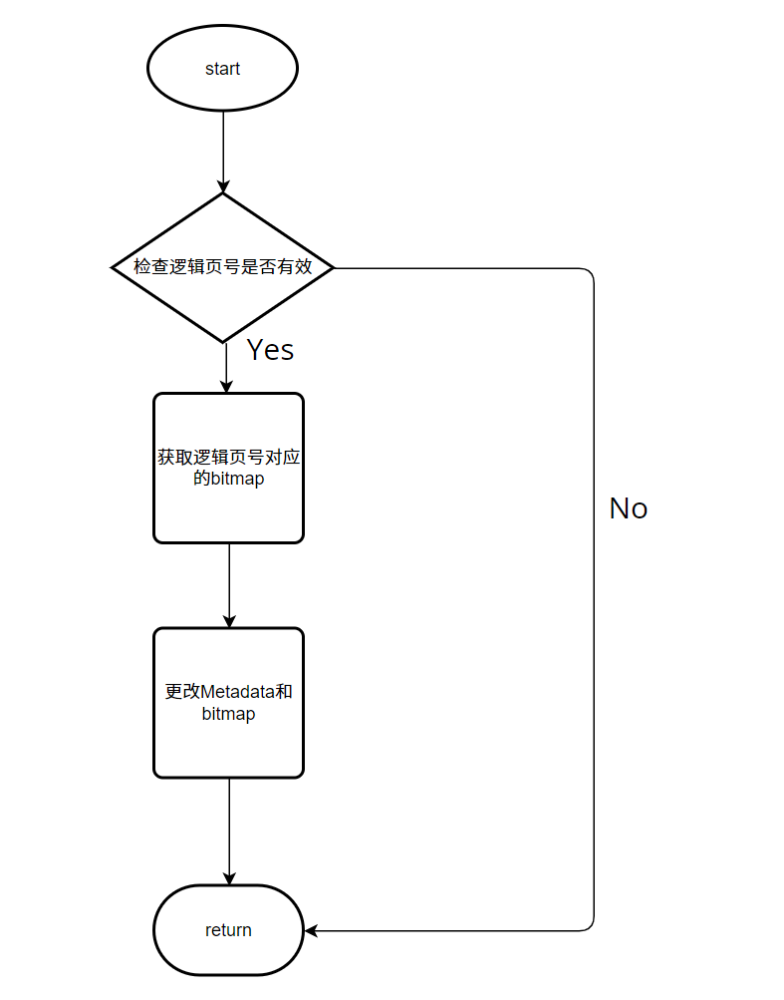

## DISK AND BUFFER POOL MANAGER

### 需求分析

在MiniSQL的设计中，`Disk Manager`和`Buffer Pool Manager`模块位于架构的最底层。

`Disk Manager`主要负责数据库文件中数据页的分配和回收，以及数据页中数据的读取和写入。

`Buffer Pool Manager`中的操作对数据库系统中其他模块是透明的。系统的其它模块可以使用数据页唯一标识符`page_id`向`Buffer Pool Manager`请求对应的数据页。

`Buffer Pool Manager`维护一个数据页的内存池，通过逻辑页号与`Disk Manager`交互，读取或写出对应的数据页。

### 架构设计


### 实现细节

#### Page 类

```cpp
class Page {
  // There is book-keeping information inside the page that should only be relevant to the buffer pool manager.
  friend class BufferPoolManager;

public:
  DISALLOW_COPY(Page)

  /** Constructor. Zeros out the page data. */
  Page() { ResetMemory(); }

  /** Default destructor. */
  ~Page() = default;

  /** @return the actual data contained within this page */
  inline char *GetData() { return data_; }

  /** @return the page id of this page */
  inline page_id_t GetPageId() { return page_id_; }

  /** @return the pin count of this page */
  inline int GetPinCount() { return pin_count_; }

  /** @return true if the page in memory has been modified from the page on disk, false otherwise */
  inline bool IsDirty() { return is_dirty_; }

  /** Acquire the page write latch. */
  inline void WLatch() { rwlatch_.WLock(); }

  /** Release the page write latch. */
  inline void WUnlatch() { rwlatch_.WUnlock(); }

  /** Acquire the page read latch. */
  inline void RLatch() { rwlatch_.RLock(); }

  /** Release the page read latch. */
  inline void RUnlatch() { rwlatch_.RUnlock(); }

  /** @return the page LSN. */
  inline lsn_t GetLSN() { return *reinterpret_cast<lsn_t *>(GetData() + OFFSET_LSN); }

  /** Sets the page LSN. */
  inline void SetLSN(lsn_t lsn) { memcpy(GetData() + OFFSET_LSN, &lsn, sizeof(lsn_t)); }

protected:
  static_assert(sizeof(page_id_t) == 4);
  static_assert(sizeof(lsn_t) == 4);

  static constexpr size_t SIZE_PAGE_HEADER = 8;
  static constexpr size_t OFFSET_PAGE_START = 0;
  static constexpr size_t OFFSET_LSN = 4;

private:
  /** Zeroes out the data that is held within the page. */
  inline void ResetMemory() { memset(data_, OFFSET_PAGE_START, PAGE_SIZE); }

  /** The actual data that is stored within a page. */
  char data_[PAGE_SIZE]{};
  /** The ID of this page. */
  page_id_t page_id_ = INVALID_PAGE_ID;
  /** The pin count of this page. */
  int pin_count_ = 0;
  /** True if the page is dirty, i.e. it is different from its corresponding page on disk. */
  bool is_dirty_ = false;
  /** Page latch. */
  ReaderWriterLatch rwlatch_;
};
```

在MiniSQL中文件读写最小单位为页，在实现中为4KB。

#### disk file 组织形式


文件具体如上图所示，每一块`Extent Pages`由一个`bitmap`维护管理。`bitmap`记录了页的使用情况。所有的`bitmap`由`DiskMetaPage`维护，由此形成一个二级结构，使得一个数据库文件能够储存更多的数据。

#### disk manager 类

```cpp
class DiskManager {
public:
  explicit DiskManager(const std::string &db_file);

  ~DiskManager() {
    if (!closed) {
      Close();
    }
  }

  /**
   * Read page from specific page_id
   * Note: page_id = 0 is reserved for disk meta page
   */
  void ReadPage(page_id_t logical_page_id, char *page_data);

  /**
   * Write data to specific page
   * Note: page_id = 0 is reserved for disk meta page
   */
  void WritePage(page_id_t logical_page_id, const char *page_data);

  /**
   * Get next free page from disk
   * @return logical page id of allocated page
   */
  page_id_t AllocatePage();

  /**
   * Free this page and reset bit map
   */
  void DeAllocatePage(page_id_t logical_page_id);

  /**
   * Return whether specific logical_page_id is free
   */
  bool IsPageFree(page_id_t logical_page_id);

  /**
   * Shut down the disk manager and close all the file resources.
   */
  void Close();

  /**
   * Get Meta Page
   * Note: Used only for debug
   */
  char *GetMetaData() {
    return meta_data_;
  }

  static constexpr size_t BITMAP_SIZE = BitmapPage<PAGE_SIZE>::GetMaxSupportedSize();

private:
  /**
   * Helper function to get disk file size
   */
  int GetFileSize(const std::string &file_name);

  /**
   * Read physical page from disk
   */
  void ReadPhysicalPage(page_id_t physical_page_id, char *page_data);

  /**
   * Write data to physical page in disk
   */
  void WritePhysicalPage(page_id_t physical_page_id, const char *page_data);

  /**
   * Map logical page id to physical page id
   */
  page_id_t MapPageId(page_id_t logical_page_id);

private:
  // stream to write db file
  std::fstream db_io_;
  std::string file_name_;
  // with multiple buffer pool instances, need to protect file access
  std::recursive_mutex db_io_latch_;
  bool closed{false};
  char meta_data_[PAGE_SIZE];
  //a simple buffer pool, use a bitmap, if this bitmap is not we want, update it.
  char cur_bitmap_[PAGE_SIZE];
  uint32_t extent_id_=0;

};
```

重要成员函数：

```cpp
page_id_t AllocatePage();//新分配一个数据页，且返回其逻辑页号 
```

该函数首先获得`Metadata`和查看是否存在空闲页，若有则修改对应的`Metadata`和`bitmap`,返回逻辑页号，否则分配失败，返回无效页号。

流程图如下：	                                              


```cpp
void DeAllocatePage(page_id_t logical_page_id);//释放一个数据页，其位置由逻辑页号给出
```

该函数首先检查逻辑页号是否有效，若有效则修改对应的`Metadata`和`bitmap`，否则直接返回。

流程图如下：



#### LRU replacer 类

```cpp
class LRUReplacer : public Replacer {
public:
  /**
   * Create a new LRUReplacer.
   * @param num_pages the maximum number of pages the LRUReplacer will be required to store
   */
  explicit LRUReplacer(size_t num_pages);

  /**
   * Destroys the LRUReplacer.
   */
  ~LRUReplacer() override;

  bool Victim(frame_id_t *frame_id) override;

  void Pin(frame_id_t frame_id) override;

  void Unpin(frame_id_t frame_id) override;
  /*void Access(frame_id_t frame_id): 
   if a frame_id is accessed, move it to the begin of the lru_list
  */
  
  size_t Size() override;

private:
  // add your own private member variables here
 /*lru_list, always replace the last element of the list*/
 list<frame_id_t> lru_list; 
 size_t max_size; 
 /*frame_id mapping iterator, to quickly find where the element is*/
 unordered_map<frame_id_t, list<frame_id_t>::iterator> id_map_it;
 void Access(frame_id_t frame_id);
};
```

`LRUreplacer`用于实现`buffer pool manager`中的替换策略。

`lru_list` 维护了一系列可以被替换出内存池的页，每次需要换出时，总是选择链表末尾的页。一旦一个页被释放（Unpin）后，则将其置于链表的头。上层模块可以Pin某个页，使得此页从链表中移除，从而不会被替换。

#### BufferPoolManager 类

```cpp
class BufferPoolManager {
public:
  explicit BufferPoolManager(size_t pool_size, DiskManager *disk_manager);

  ~BufferPoolManager();

  Page *FetchPage(page_id_t page_id);

  bool UnpinPage(page_id_t page_id, bool is_dirty);

  bool FlushPage(page_id_t page_id);

  Page *NewPage(page_id_t &page_id);

  bool DeletePage(page_id_t page_id);

  bool IsPageFree(page_id_t page_id);

  //bool FlushAllPages();

  bool CheckAllUnpinned();

private:
  /**
   * Allocate new page (operations like create index/table) For now just keep an increasing counter
   */
  page_id_t AllocatePage();

  /**
   * Deallocate page (operations like drop index/table) Need bitmap in header page for tracking pages
   */
  void DeallocatePage(page_id_t page_id);


private:
  /*frame_id is the index of pages, page_id is logical page id*/
 /*buffer_pool_manager is the friend class of Page*/
  size_t pool_size_;                                        // number of pages in buffer pool
  Page *pages_;                                             // array of pages
  DiskManager *disk_manager_;                               // pointer to the disk manager.
  std::unordered_map<page_id_t, frame_id_t> page_table_;    // to keep track of pages
  Replacer *replacer_;                                      // to find an unpinned page for replacement
  std::list<frame_id_t> free_list_;                         // to find a free page for replacement
  recursive_mutex latch_;                                   // to protect shared data structure
};
```

`BufferPoolManager` 维护个一个内存池`pages_`, 在此内存池中进行页的替换。`page_table_`维护了页的逻辑页号和页在内存池中的位置。`free_list_`维护了内存池中空余的页，当`free_list_`为空时，则需要进行替换。替换的页号由`replacer`给出。

重点成员函数：

```cpp
Page *FetchPage(page_id_t page_id);//返回对应page_id逻辑页号的页的指针
```

流程图如下：


```cpp
bool UnpinPage(page_id_t page_id, bool is_dirty);
```

释放某一页。当某一页的`pin_count` 为0时，则意味这此页可被换出。

```cpp
Page *NewPage(page_id_t &page_id);
```

申请一个新的数据页，调用`disk_manager`中的`AllocatePage()`函数实现。

```cpp
bool DeletePage(page_id_t page_id);
```

删除某一页。若此页的`pin_count`为0，调用`disk_manager`中的`DeAllocatePage(page_id_t logical_page_id)`函数，否则删除失败。

