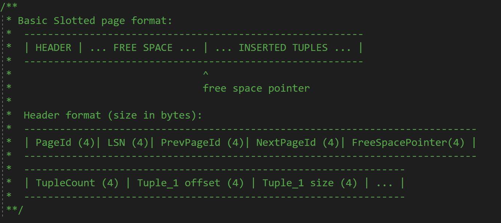

## RECORD MANAGER

### 需求分析

在MiniSQL的设计中，`Record Manager`负责管理数据表中所有的记录，它能够支持记录的插入、删除与查找操作，并对外提供相应的接口。需求如下：

`Record Manager` 需要将`Row`、`Field`、`Schema`和`Column`对象在硬盘上持久化，使得数据库数据能够长久保存。

`Record Manager`模块使用堆表管理记录，需要实现堆表的插入、删除、查询以及堆表记录迭代器的相关的功能。

### 架构设计


### 实现细节

#### Row 类 

```cpp
class Row {
  /*this friend class is added by me*/
  friend class TableIterator;

 public:
  /**
   * Row used for insert
   * Field integrity should check by upper level
   */
  explicit Row(std::vector<Field> &fields) : heap_(new SimpleMemHeap) {
    // deep copy
    for (auto &field : fields) {
      void *buf = heap_->Allocate(sizeof(Field));
      fields_.push_back(new(buf)Field(field));
    }
  }

  /**
   * Row used for deserialize
   */
  Row() = delete;

  /**
   * Row used for deserialize and update
   */
  Row(RowId rid) : rid_(rid), heap_(new SimpleMemHeap) {}

  /**
   * Row copy function
   */
  Row(const Row &other) : heap_(new SimpleMemHeap) {
    if (!fields_.empty()) {
      for (auto &field : fields_) {
        heap_->Free(field);
      }
      fields_.clear();
    }
    rid_ = other.rid_;
    for (auto &field : other.fields_) {
      void *buf = heap_->Allocate(sizeof(Field));
      fields_.push_back(new(buf)Field(*field));
    }
  }

  virtual ~Row() {
    delete heap_;
  }

  /**
   * Note: Make sure that bytes write to buf is equal to GetSerializedSize()
   */
  uint32_t SerializeTo(char *buf, Schema *schema) const;

  uint32_t DeserializeFrom(char *buf, Schema *schema);

  /**
   * For empty row, return 0
   * For non-empty row with null fields, eg: |null|null|null|, return header size only
   * @return
   */
  uint32_t GetSerializedSize(Schema *schema) const;

  inline const RowId GetRowId() const { return rid_; }

  inline void SetRowId(RowId rid) { rid_ = rid; }

  inline std::vector<Field *> &GetFields() { return fields_; }

  inline Field *GetField(uint32_t idx) const {
    ASSERT(idx < fields_.size(), "Failed to access field");
    return fields_[idx];
  }

  inline size_t GetFieldCount() const { return fields_.size(); }

private:
  Row &operator=(const Row &other) = delete;

private:
  RowId rid_{};
  std::vector<Field *> fields_;   /** Make sure that all fields are created by mem heap */
  MemHeap *heap_{nullptr};
  //static constexpr uint32_t ROW_MAGIC_NUM = 200209;
};
```

`Row` 是堆表中记录的单元。成员`rid_`维护了在堆表中的位置。`fields_`维护了此纪录的各个属性值。`heap`用于内存的分配，防止内存泄漏。

重要成员函数：

- `SerializeTo(*buf, *schema)`
  - 依次将`Row`中`field`的个数，`bitmap`，以及各个`field`的内容序列化，写入`buf`指向的内容中，其中调用已经完成的`field`的`SerializeTo`函数。
- `DeserializeFrom(*buf, *schema)`
  - 将`buf`指向的内容依次解释为`field`的个数，`bitmap`以及`field`的序列化数据。其中调用已经完成的`field`的 `DeserializeFrom`函数。
- `GetSerializedSize(*schema)`
  - 返回此`row`序列化后的字节偏移量。

#### Column 类

```cpp
class Column {
  friend class Schema;

public:
  /*this constructor have no length parameter, it is not char type*/
  Column(std::string column_name, TypeId type, uint32_t index, bool nullable, bool unique);
  /*this constructor have a length parameter, it is char type*/
  Column(std::string column_name, TypeId type, uint32_t length, uint32_t index, bool nullable, bool unique);
  /*other column copy*/
  Column(const Column *other);

  std::string GetName() const { return name_; }

  uint32_t GetLength() const { return len_; }

  void SetTableInd(uint32_t ind) { table_ind_ = ind; }

  uint32_t GetTableInd() const { return table_ind_; }

  bool IsNullable() const { return nullable_; }

  bool IsUnique() const { return unique_; }

  TypeId GetType() const { return type_; }

  uint32_t SerializeTo(char *buf) const;
   
  void SetUnique() { unique_ = true; }
  
  uint32_t GetSerializedSize() const;
  /*deserialize is a static function*/
  static uint32_t DeserializeFrom(char *buf, Column *&column, MemHeap *heap);

private:
  static constexpr uint32_t COLUMN_MAGIC_NUM = 210928;
  std::string name_;
  TypeId type_;
  uint32_t len_{0};       // for char type this is the maximum byte length of the string data,
  // otherwise is the fixed size
  uint32_t table_ind_{0}; // column position in table
  bool nullable_{false};  // whether the column can be null
  bool unique_{false};    // whether the column is unique
};
```

`Column`维护了表的某一列的元信息。`name_` 是这一列的属性名。`type_`是此列的类型名。`len_`只在`type_`为字符串时有意义，标识了最大字符串长度。`table_ind_`记录了此列在表中的位置。`nullable_`和`unique_`分别标识此列是否可以为`null` 和是否唯一。

重要成员函数：

- `SerializeTo(*buf)`
  - 依次将`Column`中的`COLUMN_MAGIC_NUM`,`name_.length()`,`name_`,`type_`,`len_`,`table_ind_`,`nullable_`,`unique_`写入`buf`指向的内容。
- `DeserializeFrom(*buf, *&column, *heap)`
  - 将`buf`指向的内容依次解释为`COLUMN_MAGIC_NUM`,`name_.length()`,`name_`,`type_`,`len_`,`table_ind_`,`nullable_`,`unique_`。其中需要验证`COLUMN_MAGIC_NUM`。
- `GetSerializedSize()`
  - 返回`Column`序列化的字节偏移量

#### Schema 类

```cpp
class Schema {
public:
  explicit Schema(const std::vector<Column *> columns) : columns_(std::move(columns)) {}

  inline const std::vector<Column *> &GetColumns() const { return columns_; }

  inline  Column *GetColumn(const uint32_t column_index) const { return columns_[column_index]; }

  dberr_t GetColumnIndex(const std::string &col_name, uint32_t &index) const {
    for (uint32_t i = 0; i < columns_.size(); ++i) {
      if (columns_[i]->GetName() == col_name) {
        index = i;
        return DB_SUCCESS;
      }
    }
    return DB_COLUMN_NAME_NOT_EXIST;
  }

  inline uint32_t GetColumnCount() const { return static_cast<uint32_t>(columns_.size()); }

  /**
   * Shallow copy schema, only used in index
   *
   * @param: attrs Column index map from index to tuple
   * eg: Tuple(A, B, C, D)  Index(D, A) ==> attrs(3, 0)
   */
  static Schema *ShallowCopySchema(const Schema *table_schema, const std::vector<uint32_t> &attrs, MemHeap *heap) {
    std::vector<Column *> cols;
    cols.reserve(attrs.size());
    for (const auto i : attrs) {
      cols.emplace_back(table_schema->columns_[i]);
    }
    void *buf = heap->Allocate(sizeof(Schema));
    return new(buf) Schema(cols);
  }

  /**
   * Deep copy schema
   */
  static Schema *DeepCopySchema(const Schema *from, MemHeap *heap) {
    std::vector<Column *> cols;
    for (uint32_t i = 0; i < from->GetColumnCount(); i++) {
      void *buf = heap->Allocate(sizeof(Column));
      cols.push_back(new(buf)Column(from->GetColumn(i)));
    }
    void *buf = heap->Allocate(sizeof(Schema));
    return new(buf) Schema(cols);
  }

  /**
   * Only used in table
   */
  uint32_t SerializeTo(char *buf) const;

  /**
   * Only used in table
   */
  uint32_t GetSerializedSize() const;

  /**
   * Only used in table
   */
  static uint32_t DeserializeFrom(char *buf, Schema *&schema, MemHeap *heap);

private:
  static constexpr uint32_t SCHEMA_MAGIC_NUM = 200715;
  std::vector<Column *> columns_;   /** don't need to delete pointer to column */
};
```

`Schema`维护了一系列`Column`作为表的元信息。

重要成员函数

- `SerializeTo(*buf)`
  - 依次将`SCHEMA_MAGIC_NUM`,`columns_.size()`,以及各个`Column`内容序列化，写入`buf`指向的内容，其中调用`Column::SerializeTo(*buf)`。
- `DeserializeFrom(*buf, *&schema, *heap)`
  - 依次将`buf`指向的内容解释为`SCHEMA_MAGIC_NUM`,`columns_.size()`以及各个`column`的序列化数据，其中调用`Column::DeserializeFrom(*buf, *&column, *heap)`且须验证`SCHEMA_MAGIC_NUM`。
- `GetSerializedSize()`
  - 返回`Schema`序列化的字节偏移量

#### TableHeap 类

堆表结构如下图所示：


在堆表中，页和页以链表的形式组织在一起。页的头部数据保存了本页页号，上一页的页号以及下一页的页号。堆表页的结构如下图所示：



堆表的类定义：

```cpp
class TableHeap {
  friend class TableIterator;

public:
  static TableHeap *Create(BufferPoolManager *buffer_pool_manager, Schema *schema, Transaction *txn,
                           LogManager *log_manager, LockManager *lock_manager, MemHeap *heap) {
    void *buf = heap->Allocate(sizeof(TableHeap));
    return new(buf) TableHeap(buffer_pool_manager, schema, txn, log_manager, lock_manager);
  }

  static TableHeap *Create(BufferPoolManager *buffer_pool_manager, page_id_t first_page_id, Schema *schema,
                           LogManager *log_manager, LockManager *lock_manager, MemHeap *heap) {
    void *buf = heap->Allocate(sizeof(TableHeap));
    return new(buf) TableHeap(buffer_pool_manager, first_page_id, schema, log_manager, lock_manager);
  }

  ~TableHeap() {}

  /**
   * Insert a tuple into the table. If the tuple is too large (>= page_size), return false.
   * @param[in/out] row Tuple Row to insert, the rid of the inserted tuple is wrapped in object row
   * @param[in] txn The transaction performing the insert
   * @return true iff the insert is successful
   */
  bool InsertTuple(Row &row, Transaction *txn);

  /**
   * Mark the tuple as deleted. The actual delete will occur when ApplyDelete is called.
   * @param[in] rid Resource id of the tuple of delete
   * @param[in] txn Transaction performing the delete
   * @return true iff the delete is successful (i.e the tuple exists)
   */
  bool MarkDelete(const RowId &rid, Transaction *txn);

  /**
   * if the new tuple is too large to fit in the old page, return false (will delete and insert)
   * @param[in] row Tuple of new row
   * @param[in] rid Rid of the old tuple
   * @param[in] txn Transaction performing the update
   * @return true is update is successful.
   */
  bool UpdateTuple(Row &row, RowId &rid, Transaction *txn);

  /**
   * Called on Commit/Abort to actually delete a tuple or rollback an insert.
   * @param rid Rid of the tuple to delete
   * @param txn Transaction performing the delete.
   */
  void ApplyDelete(const RowId &rid, Transaction *txn);

  /**
   * Called on abort to rollback a delete.
   * @param[in] rid Rid of the deleted tuple.
   * @param[in] txn Transaction performing the rollback
   */
  void RollbackDelete(const RowId &rid, Transaction *txn);

  /**
   * Read a tuple from the table.
   * @param[in/out] row Output variable for the tuple, row id of the tuple is wrapped in row
   * @param[in] txn transaction performing the read
   * @return true if the read was successful (i.e. the tuple exists)
   */
  bool GetTuple(Row *row, Transaction *txn);

  /**
   * Free table heap and release storage in disk file
   */
  void FreeHeap();

  /**
   * @return the begin iterator of this table
   */
  TableIterator Begin(Transaction *txn);

  /**
   * @return the end iterator of this table
   */
  TableIterator End();

  /**
   * @return the id of the first page of this table
   */
  inline page_id_t GetFirstPageId() const { return first_page_id_; }

private:
  /**
   * create table heap and initialize first page
   */
  explicit TableHeap(BufferPoolManager *buffer_pool_manager, Schema *schema, Transaction *txn,
                     LogManager *log_manager, LockManager *lock_manager) :
          buffer_pool_manager_(buffer_pool_manager),
          first_page_id_(INVALID_PAGE_ID),
          schema_(schema),
          log_manager_(log_manager),
          lock_manager_(lock_manager){
  };

  /**
   * load existing table heap by first_page_id
   */
  explicit TableHeap(BufferPoolManager *buffer_pool_manager, page_id_t first_page_id, Schema *schema,
                     LogManager *log_manager, LockManager *lock_manager)
          : buffer_pool_manager_(buffer_pool_manager),
            first_page_id_(first_page_id),
            schema_(schema),
            log_manager_(log_manager),
            lock_manager_(lock_manager) {}

private:
  BufferPoolManager *buffer_pool_manager_;
  page_id_t first_page_id_;
  Schema *schema_;
  [[maybe_unused]] LogManager *log_manager_;
  [[maybe_unused]] LockManager *lock_manager_;
};


```

关键成员函数：

- `InsertTuple`:

​		流程图如下：


​		使用`first fit`策略找到第一个可以容纳此记录的数据页，若不存在则分配一个新页插入链表表头。插入此记录。

- `UpdateTuple`:

  流程图如下：

  

  

​	