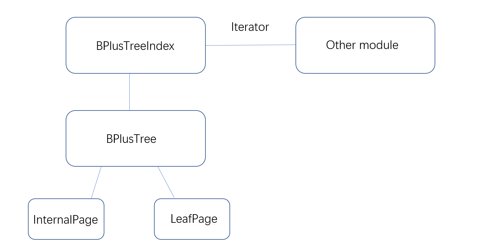
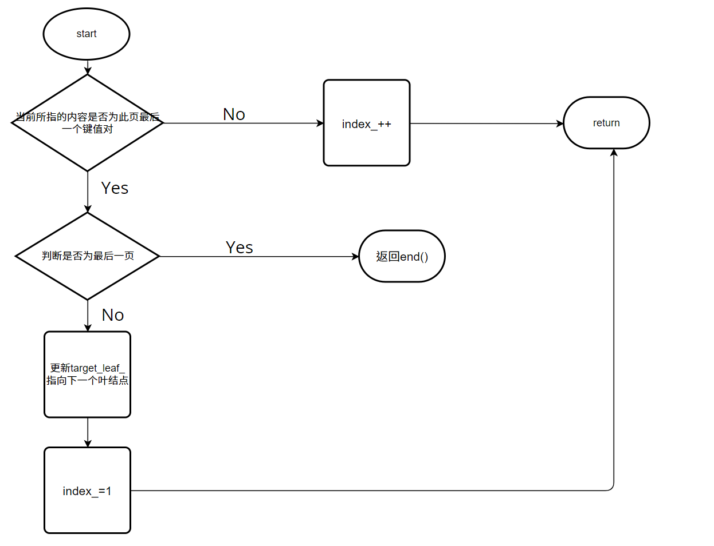

## INDEX MANAGER

### 需求分析

在MiniSQL的设计中，仅仅使用遍历堆表线性查找记录效率低效。因此我们需要实现索引根据键值快速查找。

`Index Manager `负责数据表索引的实现和管理，包括：索引的创建和删除，索引键的等值查找，索引键的范围查找（返回对应的迭代器），以及插入和删除键值等操作，并对外提供相应的接口。

具体实现时，我们选择b+树的数据结构构建索引。

### 架构设计



​	`BPlusTreeIndex`提供了迭代器和接口供上层调用。`BPlusTreeIndex`自身维护一颗b+树以及索引信息。

### 实现细节

#### B+树数据页

##### BPlusTreePage 类

```cpp
class BPlusTreePage {
public:
  bool IsLeafPage() const;

  bool IsRootPage() const;

  void SetPageType(IndexPageType page_type);

  int GetSize() const;

  void SetSize(int size);

  void IncreaseSize(int amount);

  int GetMaxSize() const;

  void SetMaxSize(int max_size);

  int GetMinSize() const;

  page_id_t GetParentPageId() const;

  void SetParentPageId(page_id_t parent_page_id);

  page_id_t GetPageId() const;

  void SetPageId(page_id_t page_id);

  void SetLSN(lsn_t lsn = INVALID_LSN);

private:
  // member variable, attributes that both internal and leaf page share
  [[maybe_unused]] IndexPageType page_type_;
  [[maybe_unused]] lsn_t lsn_;
  [[maybe_unused]] int size_;
  [[maybe_unused]] int max_size_;
  [[maybe_unused]] page_id_t parent_page_id_;
  [[maybe_unused]] page_id_t page_id_;
};
```

在b+树的实现中，我们将一个数据页作为b+树的一个结点。`BPlusTreePage` 作为`BPlusTreeInternalPage`和`BPlusTreeLeafPage`的父类，提供了两种数据页一般性的数据内容，如此页类型（为叶结点还是内部结点），此页页号`page_id_`,父页页号`parent_page_id_`，以及所容纳的键值对个数和上限。

##### BPlusTreeInternalPage 类

```cpp
INDEX_TEMPLATE_ARGUMENTS
class BPlusTreeInternalPage : public BPlusTreePage {
public:
  // must call initialize method after "create" a new node
  void Init(page_id_t page_id, page_id_t parent_id = INVALID_PAGE_ID, int max_size = INTERNAL_PAGE_SIZE);

  KeyType KeyAt(int index) const;

  void SetKeyAt(int index, const KeyType &key);

  //here I add a new function SetValueAt(int index, const ValueType& value);
  void SetValueAt(int index, const ValueType &value);


  int ValueIndex(const ValueType &value) const;

  ValueType ValueAt(int index) const;

  ValueType Lookup(const KeyType &key, const KeyComparator &comparator) const;

  void PopulateNewRoot(const ValueType &old_value, const KeyType &new_key, const ValueType &new_value);

  int InsertNodeAfter(const ValueType &old_value, const KeyType &new_key, const ValueType &new_value);

  void Remove(int index);

  ValueType RemoveAndReturnOnlyChild();

  // Split and Merge utility methods
  void MoveAllTo(BPlusTreeInternalPage *recipient, const KeyType &middle_key, BufferPoolManager *buffer_pool_manager);

  /*buffer_pool_manager here is to change those child's parent_id*/
  void MoveHalfTo(BPlusTreeInternalPage *recipient, BufferPoolManager *buffer_pool_manager);
  //void MoveHalfTo(BPlusTreeInternalPage *recipient);

  void MoveFirstToEndOf(BPlusTreeInternalPage *recipient, const KeyType &middle_key,
                        BufferPoolManager *buffer_pool_manager);

  void MoveLastToFrontOf(BPlusTreeInternalPage *recipient, const KeyType &middle_key,
                         BufferPoolManager *buffer_pool_manager);

private:
  void CopyNFrom(MappingType *items, int size, BufferPoolManager *buffer_pool_manager);

  void CopyLastFrom(const MappingType &pair, BufferPoolManager *buffer_pool_manager);

  void CopyFirstFrom(const MappingType &pair, BufferPoolManager *buffer_pool_manager);

  MappingType array_[0];
};
```

内部结点中维护了一个键值对数组，即键值-指针，按照顺序存储个键和个指针（这些指针记录的是子结点的`page_id`）。由于键和指针的数量不相等，因此我们需要将第一个键设置为INVALID，也就是说，顺序查找时需要从第二个键开始查找。

在任何时候，每个内部结点至少是半满的（Half Full）。当删除操作导致某个结点不满足半满的条件，需要通过合并（Merge）相邻两个结点或是从另一个结点中借用（移动）一个元素到该结点中（Redistribute)来使该结点满足半满的条件。当插入操作导致某个结点溢出时，需要将这个结点分裂成为两个结点。

内部结点中重要的成员函数：

- `Lookup(key, comparator)`:查找对应某个key的值，在具体实现时为指针，即`page_id`。使用二分查找实现。
- `MoveHalfTo(*recipient, *buffer_pool_manager)`:将其中一半的`pair`转移到`recipient`中，用于分裂。
- `MoveFirstToEndOf(*recipient, &middle_key, *buffer_pool_manager)`:将此页第1个元素移动到`recipient`末尾。用于删除时的重新分配。
- `MoveLastToFrontOf(*recipient, &middle_key, *buffer_pool_manager)`:将此页最后1个的元素移动到`recipient`末尾。用于删除时的重新分配。
- `MoveAllTo(*recipient, const &middle_key, *buffer_pool_manager)`: 将此页中的所有元素移动到`recipient`中。用于删除时的合并操作。

##### BPlusTreeLeafPage 类

```cpp
INDEX_TEMPLATE_ARGUMENTS
class BPlusTreeLeafPage : public BPlusTreePage {
public:
  // After creating a new leaf page from buffer pool, must call initialize
  // method to set default values
  void Init(page_id_t page_id, page_id_t parent_id = INVALID_PAGE_ID, int max_size = LEAF_PAGE_SIZE);

  // helper methods
  page_id_t GetNextPageId() const;

  void SetNextPageId(page_id_t next_page_id);

  KeyType KeyAt(int index) const;

  int KeyIndex(const KeyType &key, const KeyComparator &comparator) const;

  const MappingType &GetItem(int index);

  // insert and delete methods
  int Insert(const KeyType &key, const ValueType &value, const KeyComparator &comparator);


  /*I add a int& index to store the return index*/
  bool Lookup(const KeyType &key, ValueType &value, const KeyComparator &comparator) const;

  int RemoveAndDeleteRecord(const KeyType &key, const KeyComparator &comparator);

  // Split and Merge utility methods
  void MoveHalfTo(BPlusTreeLeafPage *recipient);

  void MoveAllTo(BPlusTreeLeafPage *recipient);

  void MoveFirstToEndOf(BPlusTreeLeafPage *recipient);

  void MoveLastToFrontOf(BPlusTreeLeafPage *recipient);

private:
  void CopyNFrom(MappingType *items, int size);

  void CopyLastFrom(const MappingType &item);

  void CopyFirstFrom(const MappingType &item);

  page_id_t next_page_id_;
  MappingType array_[0];
};
```

和内部节点类似，叶节点中按照顺序存储个键和个值。此外叶节点通过链表的形式连接。`next_page_id_`存放下一页的页号。这种组织形式有利于b+树数据的遍历，对后续模块的范围查找提供了接口支持。

叶节点重要成员函数：

- `MoveHalfTo(*recipient)`:将其中一半的`pair`转移到`recipient`中，用于分裂。
- `MoveFirstToEndOf(*recipient)`:将此页第1个元素移动到`recipient`末尾。用于删除时的重新分配。
- `MoveLastToFrontOf(*recipient)`:将此页最后1个的元素移动到`recipient`末尾。用于删除时的重新分配。
- `MoveAllTo(*recipient)`: 将此页中的所有元素移动到`recipient`中。用于删除时的合并操作。


叶节点的在分裂合并时和内部节点稍有不同，内部节点还需要使用`buffer_pool_manager`维护儿子的`parent_page_id`的更改。

#### BPlusTree 类

```cpp
class BPlusTree {
  using InternalPage = BPlusTreeInternalPage<KeyType, page_id_t, KeyComparator>;
  using LeafPage = BPlusTreeLeafPage<KeyType, ValueType, KeyComparator>;

public:
  explicit BPlusTree(index_id_t index_id, BufferPoolManager *buffer_pool_manager, const KeyComparator &comparator,
                    int leaf_max_size = LEAF_PAGE_SIZE, int internal_max_size = INTERNAL_PAGE_SIZE );

  // Returns true if this B+ tree has no keys and values.
  bool IsEmpty() const;

  // Insert a key-value pair into this B+ tree.
  bool Insert(const KeyType &key, const ValueType &value, Transaction *transaction = nullptr);

  // Remove a key and its value from this B+ tree.
  void Remove(const KeyType &key, Transaction *transaction = nullptr);

  // return the value associated with a given key
  bool GetValue(const KeyType &key, std::vector<ValueType> &result, int& position, page_id_t &leaf_page_id, Transaction *transaction = nullptr);

  INDEXITERATOR_TYPE Begin();

  INDEXITERATOR_TYPE Begin(const KeyType &key);

  INDEXITERATOR_TYPE End();

  // expose for test purpose
  Page *FindLeafPage(const KeyType &key, bool leftMost = false);

  // used to check whether all pages are unpinned
  bool Check();

  // destroy the b plus tree
  void Destroy();

  void PrintTree(std::ofstream &out) {
    if (IsEmpty()) {
      return;
    }
    out << "digraph G {" << std::endl;
    Page *root_page = buffer_pool_manager_->FetchPage(root_page_id_);
    BPlusTreePage *node = reinterpret_cast<BPlusTreePage *>(root_page);
    ToGraph(node, buffer_pool_manager_, out);
    out << "}" << std::endl;
  }

private:
  void StartNewTree(const KeyType &key, const ValueType &value);

  bool InsertIntoLeaf(const KeyType &key, const ValueType &value, Transaction *transaction = nullptr);

  void InsertIntoParent(BPlusTreePage *old_node, const KeyType &key, BPlusTreePage *new_node,
                        Transaction *transaction = nullptr);

  //In Destroy function 
  void DestroyPage(BPlusTreePage *page);

  template<typename N>
  N *Split(N *node);

  
  template<typename N>
  bool CoalesceOrRedistribute(N *node, Transaction *transaction = nullptr);

  
  template<typename N>
  bool Coalesce(N **neighbor_node, N **node, BPlusTreeInternalPage<KeyType, page_id_t, KeyComparator> 						**parent, int index, Transaction *transaction = nullptr);

  template<typename N>
  void Redistribute(N *neighbor_node, N *node, int index);

  bool AdjustRoot(BPlusTreePage *node);

  void UpdateRootPageId(int insert_record = 0);

  /* Debug Routines for FREE!! */
  void ToGraph(BPlusTreePage *page, BufferPoolManager *bpm, std::ofstream &out) const;

  void ToString(BPlusTreePage *page, BufferPoolManager *bpm) const;

  // member variable
  index_id_t index_id_;
  page_id_t root_page_id_;
  BufferPoolManager *buffer_pool_manager_;
  KeyComparator comparator_;
  int leaf_max_size_;
  int internal_max_size_;
};
```

使用`BPlusTree`实现b+树。

成员说明：

- `index_id_`: b+树所属索引的id

- `root_page_id_` :b+树根结点页号，初始化为`INVALID_PAGE_ID`
- `comparator_`: 用于比较键值
- `leaf_max_size_`：叶节点最大键值对个数
- `internal_max_size_`：内部节点最大键值对个数

#### b+树插入算法：

伪代码如下：

```pseudocode
procedure insert(value K, pointer P)
if (tree is empty) create an empty leaf node L, which is also the root
else InsertIntoLeaf(K,P)
end
```

```pseudocode
procedure InsertIntoLeaf(value K, pointer P)
Find the target leaf L 
if(L can hold one more value ) insert pair(K,P)
else begin
Split the leaf L as L, L1
insert pair(K,P) into L or L1
InsertIntoParent(L,L1)
end
end
```

```pseudocode
procedure InsertIntoParent(node N，node N1)
if(N is the root) 
	then begin
		create a new node R containing the pointer to N and N1, and the values.
		make N, N1 as R's children
		make R as the bplustree's root 
		return
	end 
Let P=N's parent
if(P can hold one more child)
	then make N1 as P's child 
else begin
	Split P as P,P1
	make N1 as P or P1's child
    InsertIntoParent(P,P1)
end
end
```

​	在真正实现b+树时，我们采取维护内部节点第一个键值的做法。

#### b+树删除算法

伪代码如下：

```pseudocode
procedure remove(value K, pointer P)
if(the tree is empty) then return
Find the target leaf L that should contains  (K,P)
delete the pair(K,P) in L
update the value in L's parent up towards root if neccessary
if(the size of L is less than the minimum size)
	then CoalesceOrRedistribute(L)
end
```

```pseudocode
procedure CoalesceOrRedistribute(Node N)
if(N is the root and N has only one child)
	then adjust the root to the child of N
else begin
	Let L1 = the previous or next child of parent(N)
	if(L can borrow a value from L1)
		then Redistribute(L,L1)
	else if(L1 and L can be fit into a node)
		then begin 
		Coalesce(L1,L)
		if(the size of the parent of L is less than the minimum size)
			then CoalesceOrRedistribute(L's parent)
		end
end
end
```

#### b+树索引迭代器

```cpp
INDEX_TEMPLATE_ARGUMENTS
class IndexIterator {
public:
  // you may define your own constructor based on your member variables
  using LeafPage = BPlusTreeLeafPage<KeyType, ValueType, KeyComparator>;

  explicit IndexIterator(LeafPage *target_leaf, int index, BufferPoolManager *buffer_pool_manager);

  explicit IndexIterator(page_id_t leaf_page_id, int position, BufferPoolManager *buffer_pool_manager);

  ~IndexIterator();

  /** Return the key/value pair this iterator is currently pointing at. */
  const MappingType &operator*();

  /** Move to the next key/value pair.*/
  IndexIterator &operator++();

  /** Return whether two iterators are equal */
  bool operator==(const IndexIterator &itr) const;

  /** Return whether two iterators are not equal. */
  bool operator!=(const IndexIterator &itr) const;

private:
  // add your own private member variables here
  LeafPage* target_leaf_;
  int index_;
  BufferPoolManager *buffer_pool_manager_;//for unpin the page and fetch page 
};
```

成员说明:

- `target_leaf_`：叶节点指针
- `index_`:此迭代器所指内容在叶节点中的下标

重要操作符重载：

- `IndexIterator &operator++()`

流程图如下：

