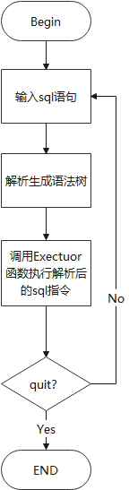
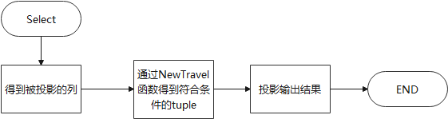

## Executor

### 需求分析

`Executor`（执行器）的主要功能是根据解释器（Parser）生成的语法树，通过`Catalog Manager `提供的信息生成执行计划，并调用 `Record Manager`、`Index Manager `和 `Catalog Manager `提供的相应接口进行执行

### 架构设计

#### main函数执行：



#### Exector中函数的实现细节：

##### `ExecuteEngine`类

```cpp
class ExecuteEngine {
public:
  ExecuteEngine();

  ~ExecuteEngine() {
    for (auto it : dbs_) {
      delete it.second;
    }
  }
  /**
   * executor interface
   */
  dberr_t Execute(pSyntaxNode ast, ExecuteContext *context);
private:
  dberr_t ExecuteCreateDatabase(pSyntaxNode ast, ExecuteContext *context);
  dberr_t ExecuteDropDatabase(pSyntaxNode ast, ExecuteContext *context);
  dberr_t ExecuteShowDatabases(pSyntaxNode ast, ExecuteContext *context);
  dberr_t ExecuteUseDatabase(pSyntaxNode ast, ExecuteContext *context);
  dberr_t ExecuteShowTables(pSyntaxNode ast, ExecuteContext *context);
  dberr_t ExecuteCreateTable(pSyntaxNode ast, ExecuteContext *context);
  dberr_t ExecuteDropTable(pSyntaxNode ast, ExecuteContext *context);
  dberr_t ExecuteShowIndexes(pSyntaxNode ast, ExecuteContext *context);
  dberr_t ExecuteCreateIndex(pSyntaxNode ast, ExecuteContext *context);
  dberr_t ExecuteDropIndex(pSyntaxNode ast, ExecuteContext *context);
  dberr_t ExecuteSelect(pSyntaxNode ast, ExecuteContext *context);
  dberr_t ExecuteInsert(pSyntaxNode ast, ExecuteContext *context);
  dberr_t ExecuteDelete(pSyntaxNode ast, ExecuteContext *context);
  dberr_t ExecuteUpdate(pSyntaxNode ast, ExecuteContext *context);
  dberr_t ExecuteTrxBegin(pSyntaxNode ast, ExecuteContext *context);
  dberr_t ExecuteTrxCommit(pSyntaxNode ast, ExecuteContext *context);
  dberr_t ExecuteTrxRollback(pSyntaxNode ast, ExecuteContext *context);
  dberr_t ExecuteExecfile(pSyntaxNode ast, ExecuteContext *context);
  dberr_t ExecuteQuit(pSyntaxNode ast, ExecuteContext *context);
  CmpBool Travel(TableInfo *currenttable, TableIterator &tableit, pSyntaxNode root);
  CmpBool TravelWithoutIndex(TableInfo *currenttable, TableIterator &tableit, pSyntaxNode root);
  dberr_t NewTravel(DBStorageEngine *Currentp, TableInfo *currenttable,
                           pSyntaxNode root, vector<RowId> *result);
private:
  bool isRecons;
  [[maybe_unused]] std::unordered_map<std::string, DBStorageEngine *> dbs_;  /** all opened databases */
  [[maybe_unused]] std::string current_db_;  /** current database */
};
```

其中`isRecons`变量用来记录是否已经将内存中已有的database进行重建。

##### 构造函数和析构函数

```cpp
// 将isRecons初始化为false，只有第一条语句时需要检查内存并且重建先前的database
ExecuteEngine::ExecuteEngine() { isRecons = false; } 
// 释放当前已经打开的数据库
ExecuteEngine::~ExecuteEngine() {
    for (auto it : dbs_) {
      delete it.second;
    }
}
```

##### Database相关函数

- `dberr_t ExecuteEngine::ExecuteCreateDatabase`
  - 先在`databasefile.txt`找是否已经有同名数据库
  - 建立数据库，插入`unordered_map dbs_`中，记录当前的数据库
- `dberr_t ExecuteEngine::ExecuteDropDatabase`
  - 在`dbs_`中找到该数据库，删除
  - 在文件`databasefile.txt`中删除
- `dberr_t ExecuteEngine::ExecuteShowDatabases`
  - 打印`db_`中已有的数据库
- `dberr_t ExecuteEngine::ExecuteUseDatabase`
  - 找到database并把它作为`current_db_`

##### Tables相关函数

- `ExecuteEngine::ExecuteShowTables(*ast, *context)`

  - 在`Current Database`中的`catalog_mgr_`中的函数`GetTables()`得到当前`use`的数据库中的表名，输出。

- `ExecuteEngine::ExecuteCreateTable(*ast, *context)`

  - 遍历语法树将column和type的信息收集，形成一个列的`vector`
  - 注意`primary key`，该列不能有重复的元素
  - 在`Current database`中的`catalog_mgr_`中调用`CreateTable()`来新建一个table

  

- `ExecuteEngine::ExecuteDropTable(*ast, *context)`
  - 从语法树中得到需要被drop的table name
  - 调用`current database`中的`catalog_mgr_`中的`DropTable()`函数来drop

##### Index相关函数

- `ExecuteEngine::ExecuteShowIndexes(*ast, *context)`

  - 用`catalog_mgr_` 中的`GetTableIndexes()`来得到表的索引并且打印

- `ExecuteEngine::ExecuteCreateIndex(*ast, *context)`

  

  - 检查是否在唯一键上建立索引，如果不是输出提示语
  - 调用`current database`中的`catalog_mgr_`中的`CreateIndex()`函数

- `ExecuteEngine::ExecuteDropIndex(*ast, *context)`
  - 在现有的tables中寻找同名的index
  - 调用`current database`中的`catalog_mgr_`中的`DropIndex()`函数

##### 增删查改相关函数

- `ExecuteEngine::ExecuteSelect(*ast, *context)`

  

  `NewTravel()`函数是以语法树条件部分的根节点为参数，通过筛选条件后进行布尔运算，得到符合条件的元组。(在insert、delete、update中也需要用这个方法得到符合条件的tuple)

  

- `ExecuteEngine::ExecuteInsert(*ast, *context)`

  - 调用`current database`中的`catalog_mgr_`中的`GetTable()`函数找到要被插入的表
  - 通过语法树得到需要被插入的一条记录的type以及内容（即上文讲的`NewTravel()`函数），与该表的column做检查
  - 检查unique以及primary key，是否有冲突，如果有，输入提示语，插入失败
  - 调用`current table`中的`GetTableHeap()`中的`InsertTuple()`函数插入一条记录
  - 如果被修改的列上有index则更新index

- `ExecuteEngine::ExecuteDelete(*ast, *context)`

  - 调用`current database`中的`catalog_mgr_`中的`GetTable()`函数找到要被删除记录的表
  - 通过类似于`select`中的方法来找到需要被删除的`vector<RowId>`然后通过迭代器删除
  - 如果被修改的列上有index则更新index

- `ExecuteEngine::ExecuteUpdate(*ast, *context)`

  - 与`select`、`insert`、`delete`中原理一致
  - 更新也需判断unique和primary key等约束条件
  - 如果被修改的列上有index则更新index

##### 执行文件

- `ExecuteEngine::ExecuteExecfile(*ast, *context)`
  - 与`main.cpp`中的内容相同，将文件中的每一行指令解析语法树后通过`Execute()`执行

##### 结束

```cpp
dberr_t ExecuteEngine::ExecuteQuit(pSyntaxNode ast, ExecuteContext *context) {
#ifdef ENABLE_EXECUTE_DEBUG
  LOG(INFO) << "ExecuteQuit" << std::endl;
#endif
  ASSERT(ast->type_ == kNodeQuit, "Unexpected node type.");
  context->flag_quit_ = true; 
  return DB_SUCCESS;
}
```

